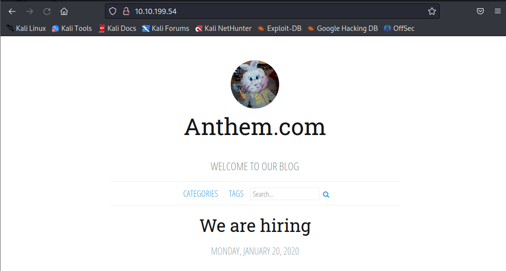
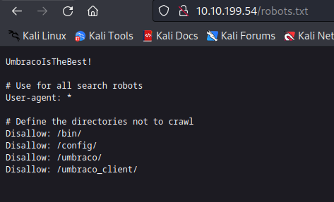
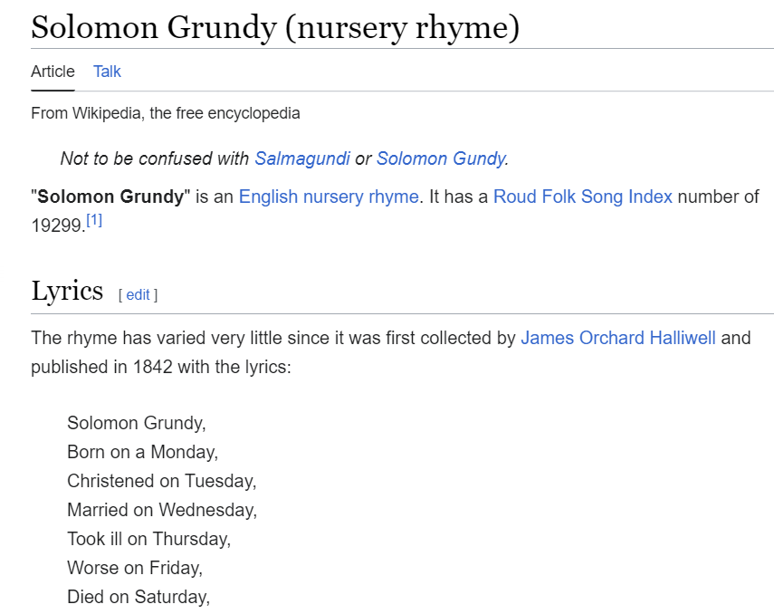
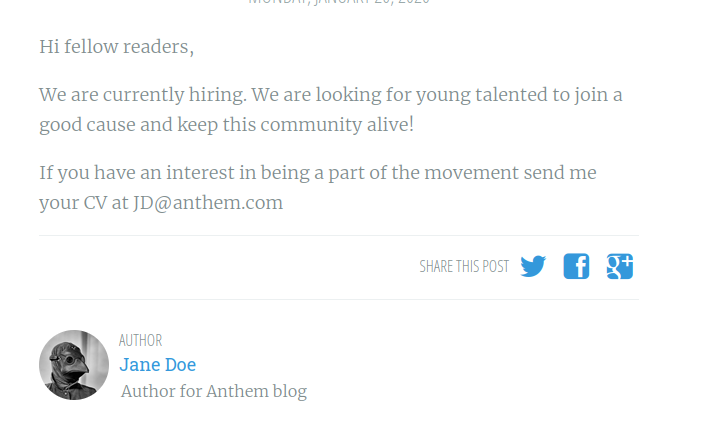
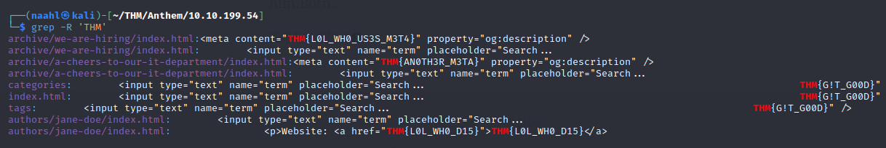
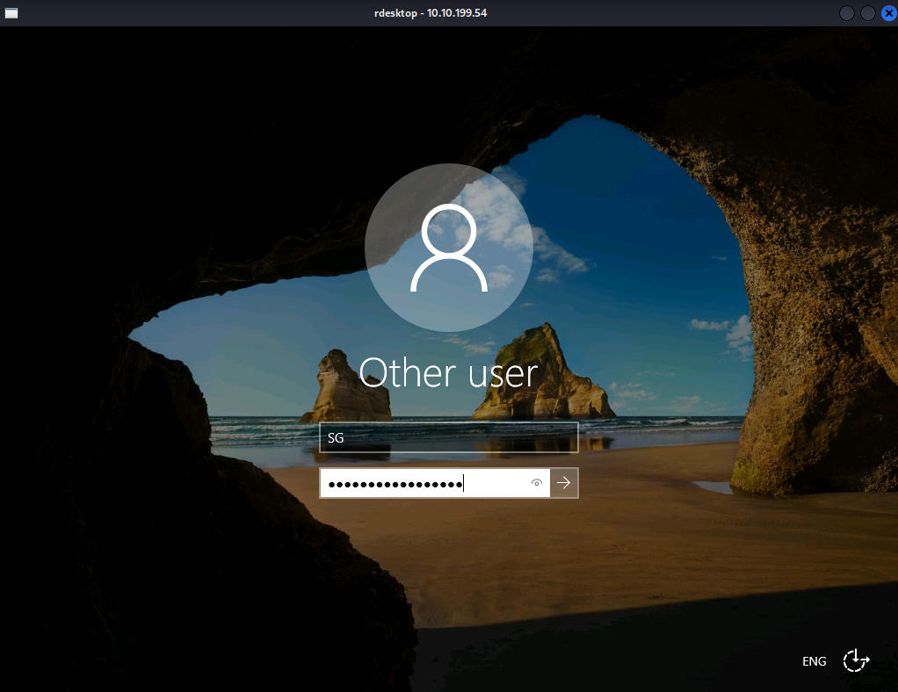
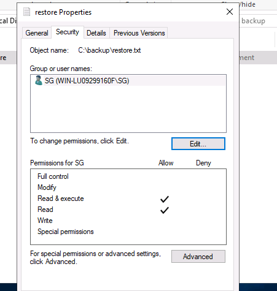
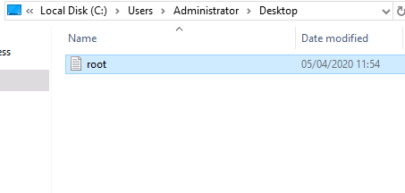

```jsx
Machine: Blue
Platform: TryHackMe
Difficulty: Easy
```

## Walkthrough:

You can find the machine [here](https://tryhackme.com/r/room/anthem).

### Website Analysis:

Lets start by a simple Nmap scan to check for open ports with `sudo nmap -sC -sV -vv $IP` command.

```console
┌──(naahl㉿kali)-[~/THM/Anthem]
└─$ nmap -sV -sC --vv -Pn 10.10.62.208
Host discovery disabled (-Pn). All addresses will be marked 'up' and scan times may be slower.
Starting Nmap 7.93 ( https://nmap.org ) at 2024-07-06 16:50 EDT
NSE: Loaded 155 scripts for scanning.
NSE: Script Pre-scanning.
NSE: Starting runlevel 1 (of 3) scan.
Initiating NSE at 16:50
Completed NSE at 16:50, 0.00s elapsed
NSE: Starting runlevel 2 (of 3) scan.
Initiating NSE at 16:50
Completed NSE at 16:50, 0.00s elapsed
NSE: Starting runlevel 3 (of 3) scan.
Initiating NSE at 16:50
Completed NSE at 16:50, 0.00s elapsed
Initiating Parallel DNS resolution of 1 host. at 16:50
Completed Parallel DNS resolution of 1 host. at 16:50, 0.04s elapsed
Initiating Connect Scan at 16:50
Scanning 10.10.62.208 [1000 ports]
Discovered open port 3389/tcp on 10.10.62.208
Discovered open port 80/tcp on 10.10.62.208
Completed Connect Scan at 16:51, 22.64s elapsed (1000 total ports)
Initiating Service scan at 16:51
Scanning 2 services on 10.10.62.208
Completed Service scan at 16:51, 21.83s elapsed (2 services on 1 host)
NSE: Script scanning 10.10.62.208.
NSE: Starting runlevel 1 (of 3) scan.
Initiating NSE at 16:51
Completed NSE at 16:51, 22.06s elapsed
NSE: Starting runlevel 2 (of 3) scan.
Initiating NSE at 16:51
NSE Timing: About 87.50% done; ETC: 16:52 (0:00:04 remaining)
NSE Timing: About 93.75% done; ETC: 16:52 (0:00:04 remaining)
NSE Timing: About 93.75% done; ETC: 16:53 (0:00:06 remaining)
Completed NSE at 16:53, 93.99s elapsed
NSE: Starting runlevel 3 (of 3) scan.
Initiating NSE at 16:53
Completed NSE at 16:53, 0.00s elapsed
Nmap scan report for 10.10.62.208
Host is up, received user-set (0.41s latency).
Scanned at 2024-07-06 16:50:43 EDT for 161s
Not shown: 998 filtered tcp ports (no-response)
PORT     STATE SERVICE       REASON  VERSION
80/tcp   open  http?         syn-ack
3389/tcp open  ms-wbt-server syn-ack Microsoft Terminal Services
| ssl-cert: Subject: commonName=WIN-LU09299160F
| Issuer: commonName=WIN-LU09299160F
| Public Key type: rsa
| Public Key bits: 2048
| Signature Algorithm: sha256WithRSAEncryption
| Not valid before: 2024-07-05T20:40:15
| Not valid after:  2025-01-04T20:40:15
| MD5:   571274bb92792bf54959201b138de188
| SHA-1: bea145aeaf5b874f269213d52de937b84bd0d753

Service Info: OS: Windows; CPE: cpe:/o:microsoft:windows

NSE: Script Post-scanning.
NSE: Starting runlevel 1 (of 3) scan.
Initiating NSE at 16:53
Completed NSE at 16:53, 0.00s elapsed
NSE: Starting runlevel 2 (of 3) scan.
Initiating NSE at 16:53
Completed NSE at 16:53, 0.00s elapsed
NSE: Starting runlevel 3 (of 3) scan.
Initiating NSE at 16:53
Completed NSE at 16:53, 0.00s elapsed
Read data files from: /usr/bin/../share/nmap
Service detection performed. Please report any incorrect results at https://nmap.org/submit/ .
Nmap done: 1 IP address (1 host up) scanned in 161.33 seconds
```

The scan gives the answer to 2nd and 3rd questions.

Open Port 80 determines there exist a website for this address. After opening the website, it shows the domain in front.



*Q. 4: What is a possible password in one of the pages web crawlers check for?*

**A robots.txt file tells search engine crawlers which URLs the crawler can access on your site.**
So, when I searched the directory *robots.txt*, it displayed the password along some other directories.



As we saw in the robots.txt, *CMS used by website is `Umbraco`*.

In the website, there are 2 articles to go through, written by user Jane Doe. In second one, there was a poem written. I searched it on Google and found it on wikipedia. There, the name was visible that was of Admin.



In the other article, an email was given. Using its format I got to know the email address of admin.

**Admin Email:** `SG@anthem.com`



### Spot the Flags:

I was able to find all the flags present on website by using these commands:

```console
wget --recursive -u http://$IP
grep -R "THM"
```


### Final Stage:

Now, let's get into the box using the information we collected till now. 
I accessed the windows with SG as user using `rdesktop` command. Then provided password found earlier.

```console
rdesktop -u SG $IP
```



We get the user.txt in the desktop containing the flag.

**User Flag:** `THM{N00T_NO0T}`

For admin password, I changed the view setting to display hidden files/directories, and it displayed the **backup folder** that contains **restore.txt** but it requires privelege access to open. So. I changed the security permissions and gave read & write access, and got the password.



**Admin Password:** `ChangeMeBaby1MoreTime`

After escalating the priveleges, I got the root flag in root.txt



**Root Flag:** `THM{Y0U_4R3_1337}`


---

Stay Tuned for more such writeups... **GRACIAS ^◡^**

---
